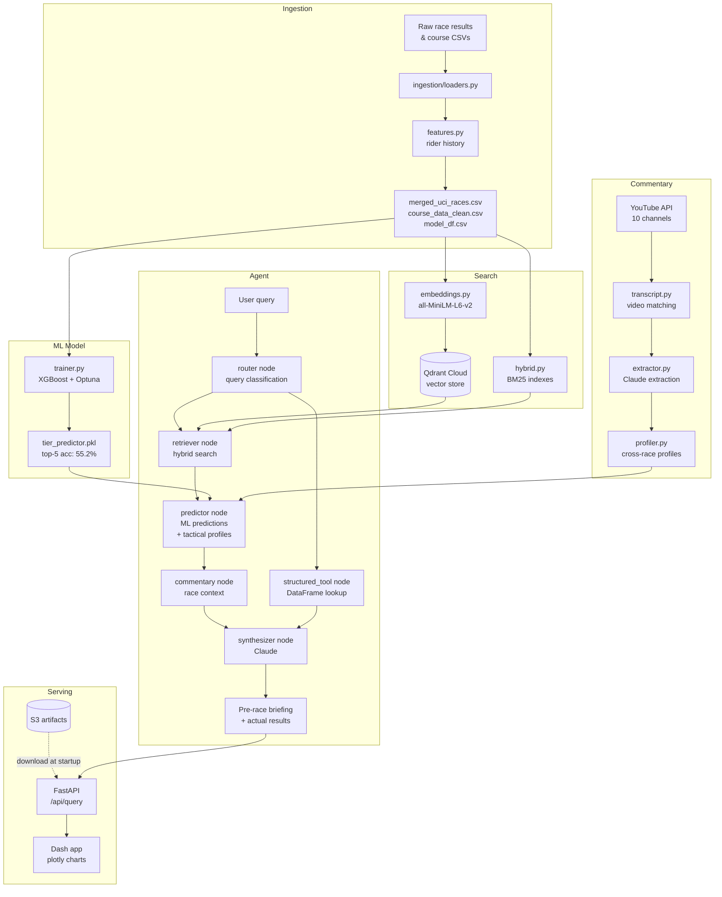

# PelotonIQ

> UCI WorldTour race intelligence combining an XGBoost finish-probability
> model, hybrid BM25 + semantic search, and tactical rider profiles
> synthesized from 300+ race commentary transcripts — served through a
> LangGraph multi-agent pipeline and a Plotly Dash interface.

[](https://github.com/jfarrell8/peloton-iq/actions/workflows/ci.yml)
[](https://www.python.org/downloads/)

---

## Live Demo

| Service | URL |
|---|---|
| **Race intelligence dashboard** | [peloton-iq-dash-production.up.railway.app](https://peloton-iq-dash-production.up.railway.app) |
| **REST API + Swagger UI** | [peloton-iq-api-production.up.railway.app/docs](https://peloton-iq-api-production.up.railway.app/docs) |

> **Note:** The agent initialises in a background thread on startup —
> downloading model artifacts and processed datasets from S3, connecting to
> Qdrant Cloud, and building BM25 indexes. The first query after a fresh
> deploy may take 30–60 seconds while this completes; subsequent queries are
> fast (~15–20s, dominated by LLM synthesis). Check `/api/health` — it
> reports `"initializing"` until the agent is ready.

---

## What makes it different

Most cycling analytics projects stop at statistics. PelotonIQ adds a layer
that can't be scraped from a leaderboard: **cross-race tactical profiles**
synthesized from race commentary.

The commentary pipeline fetches transcripts from 10 YouTube channels
(including the official Tour de France, Giro d'Italia, and Vuelta channels),
runs a Claude extraction pass to pull structured tactical observations, then
synthesizes patterns across a rider's full appearance history:

```
POGAČAR Tadej  [high confidence · 18 races]
  Attack style: Attacks on penultimate climb in 14/18 mountain stages,
                rarely from the final 2km
  Vulnerability: Has shown weakness under repeated accelerations within 3km
  • UAE controls tempo through valley sections before Pogačar accelerates
  • Won solo from breakaway 11x, never from bunch sprint in dataset
  Form: positive — strongest finishes in final Grand Tour stages
```

This profile is injected alongside the ML predictions into the synthesizer —
turning a probability table into intelligence a directeur sportif would
actually use. That's something a general-purpose LLM with web search can't
replicate without the underlying dataset.

---

## Architecture



---

## Stack

| Layer | Technology |
|---|---|
| ML model | XGBoost, Optuna (50-trial HPO), scikit-learn |
| Embeddings | sentence-transformers `all-MiniLM-L6-v2` |
| Vector store | Qdrant Cloud (hybrid dense + BM25 sparse, RRF fusion) |
| Deployment | Railway (two services, Docker, CPU-only torch) |
| Agent framework | LangGraph (5-node pipeline) |
| LLM | Anthropic Claude (routing, extraction, synthesis) |
| Commentary | YouTube Data API, youtube-transcript-api |
| API | FastAPI + Pydantic |
| UI | Plotly Dash |
| Orchestration | Prefect (6-stage pipeline with retries) |
| Artifact storage | AWS S3 (models, indexes, processed datasets) |
| Config | Pydantic Settings |
| CI | GitHub Actions + ruff |
| Data | 140k+ rows, 7 seasons (2017–2023), 8,092 GPX files |

---

## Key Design Decisions

| Decision | Rationale |
|---|---|
| **Hybrid BM25 + semantic search** | Semantic search alone misses exact race/rider name lookups. BM25 handles precise terms ("Felix Gall Stage 17") while semantic search handles conceptual queries ("hardest mountain stages"). RRF fusion combines both scores without requiring threshold tuning. |
| **XGBoost over neural networks** | The dataset (140k rows, ~30 features) is tabular and mid-size. Tree models consistently outperform NNs on this regime. XGBoost with Optuna TPE reached top-5=55.2% — a meaningful lift over a 20% naive baseline across 5 finish tiers. |
| **LangGraph over a simple chain** | Query type determines which nodes fire — a STRUCTURED query routes directly to a DataFrame tool and skips retrieval entirely. A PREDICTIVE query fires all 5 nodes. LangGraph makes this conditional routing explicit and inspectable rather than buried in prompt logic. |
| **Commentary profiles over per-race RAG** | Injecting one race's commentary gives Claude information it could find with web search. Synthesizing patterns across 18 races produces a rider's tactical signature — something that requires the specific dataset and can't be replicated by a general-purpose LLM. |
| **Parquet cache for GPX profiles** | 8,092 raw GPX files parse in ~15 minutes. At query time this is unacceptable. A one-time build step produces a single `gpx_profiles.parquet` (~80MB) keyed by race name — sub-millisecond lookup at query time, deployable without the raw files. |
| **S3 for model artifacts and processed data** | `tier_predictor.pkl`, BM25 indexes, `gpx_profiles.parquet`, and the processed CSVs (`merged_uci_races.csv`, `course_data_clean.csv`, `model_df.csv`) all exceed GitHub's practical file-size comfort zone. At startup `ensure_artifacts()` downloads any missing files from S3 before initialisation — the app starts clean on any machine without a separate data pipeline run. |
| **Background agent initialisation** | Loading the embedding model, BM25 indexes, and ~150MB of DataFrames takes 30–60s on a cold container — too slow for a synchronous request/response cycle, and slow enough to trip platform startup timeouts. The FastAPI lifespan kicks off initialisation in a background thread so the port opens immediately; `get_agent()` blocks on a threading `Event` if a request arrives before warm-up completes. |
| **Memory-efficient DataFrame loading** | `merged_df` is loaded with `usecols` + explicit `category`/`int16`/`int8` dtypes rather than pandas' default inference — meaningful savings on a memory-constrained container without changing any downstream logic. |
| **Two-service Railway deployment** | FastAPI owns the agent (heavy, slow cold start, CPU/RAM-intensive). Dash is a thin UI layer calling the API over HTTP (fast cold start, minimal deps). Separating them lets each service scale independently and keeps the Dockerfile for each service lean — `Dockerfile` for the API, `Dockerfile.dash` for the UI. |
| **Idempotent pipeline steps** | Every script checks existing state before doing work — already-fetched transcripts are skipped, already-extracted JSONs are skipped, already-built profiles are skipped. Safe to interrupt and resume at any stage without data loss or duplication. |

---

## Project Structure

```
peloton-iq/
├── src/peloton_iq/
│   ├── config.py              # Pydantic Settings, all path constants
│   ├── schemas/               # Typed data contracts (race, rider, agent, commentary)
│   ├── ingestion/             # loaders, filters, feature engineering, GPX parser
│   ├── search/                # embeddings, BM25, hybrid RRF search
│   ├── prediction/            # XGBoost trainer + predictor
│   ├── commentary/            # YouTube cache, transcript fetcher, Claude extractor, profiler
│   ├── agent/                 # LangGraph tools, nodes, graph assembly
│   ├── pipelines/             # Prefect flows (ingest, embed, train, commentary, main)
│   ├── api/                   # FastAPI app (/api/query, /api/results, /api/health)
│   ├── artifacts.py           # S3 sync — models, BM25 indexes, GPX cache, processed CSVs
│   └── app.py                 # Dash frontend
├── scripts/
│   ├── run_ingestion.py       # Build processed data from raw CSVs
│   ├── run_embeddings.py      # Load vectors into Qdrant
│   ├── run_training.py        # Train XGBoost model (50 Optuna trials)
│   ├── run_commentary.py      # Fetch transcripts + run Claude extraction
│   ├── build_profiles.py      # Build rider tactical profiles
│   ├── build_gpx_cache.py     # Parse 8,092 GPX files → single parquet
│   ├── push_artifacts.py      # Upload models + caches to S3
│   ├── run_api.py             # Start FastAPI server
│   ├── run_dash.py            # Start Dash app
│   └── run_agent.py           # CLI agent interface + sanity check
├── tests/
│   ├── conftest.py            # Synthetic DataFrame fixtures (no file I/O)
│   ├── test_tools.py          # Agent tool function tests
│   └── test_commentary.py     # Label, matching, and normalization tests
├── .github/workflows/
│   └── ci.yml                 # Lint (ruff) + pytest on every push
├── Dockerfile
├── Dockerfile.dash             # Dash service container
├── railway.json                # Railway deployment config (optional)
└── pyproject.toml
```

---

## API Reference

**Live base URL**: `https://peloton-iq-api-production.up.railway.app`
**Local base URL**: `http://localhost:8000`

| Method | Endpoint | Description |
|---|---|---|
| `POST` | `/api/query` | Natural language query through the full agent pipeline |
| `GET` | `/api/results` | Actual race results lookup by race, year, stage |
| `GET` | `/api/health` | Health check — verifies all components operational |
| `GET` | `/docs` | Auto-generated Swagger UI |

**Example query:**
```bash
curl -X POST https://peloton-iq-api-production.up.railway.app/api/query \
  -H "Content-Type: application/json" \
  -d '{"query": "Pre-race briefing for Tour de France 2023 Stage 17"}'
```

**Response includes:**
- `response` — full synthesized briefing (markdown)
- `query_type` — STRUCTURED / SEMANTIC_COURSE / SEMANTIC_RIDER / PREDICTIVE / HYBRID
- `steps` — LangGraph nodes fired (e.g. `["router", "retriever", "predictor", "commentary", "synthesizer"]`)
- `prediction_text` — raw ML probability output for chart rendering
- `race_context` — race/year/stage for results lookup

---

## Local Setup

### Prerequisites
- Python 3.12, [uv](https://docs.astral.sh/uv/), Docker

### 1. Install

```bash
git clone https://github.com/jfarrell8/peloton-iq.git
cd peloton-iq
uv pip install -e ".[dev]"
```

### 2. Environment variables

```bash
# .env in project root
PELOTON_ANTHROPIC_API_KEY=your_key
PELOTON_YOUTUBE_API_KEY=your_key
PELOTON_QDRANT_URL=https://your-cluster.qdrant.io:6333
PELOTON_QDRANT_API_KEY=your_key
PELOTON_S3_BUCKET=your-bucket        # optional — for artifact sync
```

### 3. Start Qdrant (local dev only)

```bash
docker run -p 6333:6333 qdrant/qdrant
```

### 4. Build the pipeline

```bash
python scripts/run_ingestion.py --prod      # ~2hrs for rider features
python scripts/run_embeddings.py            # ~5 mins
python scripts/run_training.py --prod       # ~15 mins, 50 Optuna trials
python scripts/build_gpx_cache.py          # ~15 mins, 8,092 GPX files
python scripts/run_commentary.py           # fetch transcripts
python scripts/run_commentary.py --extract --max-extractions 316
python scripts/build_profiles.py           # build rider tactical profiles
```

### 5. Run the app

```bash
# Terminal 1 — FastAPI backend (agent initialises here)
python scripts/run_api.py

# Terminal 2 — Dash frontend
python scripts/run_dash.py

# Open http://localhost:8050
```

### 6. CLI agent

```bash
python scripts/run_agent.py --check    # sanity check all components
python scripts/run_agent.py --query "Pre-race briefing TDF 2023 Stage 17"
python scripts/run_agent.py            # interactive mode
```

### 7. Run the full Prefect pipeline

```bash
# Commentary + profiles only (most common incremental run)
python -m peloton_iq.pipelines.main --commentary-only --extract

# Full rebuild
python -m peloton_iq.pipelines.main

# Dry run — see what would execute
python -m peloton_iq.pipelines.main --dry-run
```

---

## Tests

```bash
python -m pytest tests/ -v
```

---

## Deployment (Railway)

Two services in one Railway project, each built from its own Dockerfile:

| Service | Dockerfile | Role | Cold start |
|---|---|---|---|
| `peloton-iq-api` | `Dockerfile` | FastAPI + agent (CPU-only torch, no GPU deps) | ~30-60s (S3 artifact download + model init, runs in a background thread so the port opens immediately) |
| `peloton-iq-dash` | `Dockerfile.dash` | Plotly Dash UI | ~5s |

**Required env vars:**

For `peloton-iq-api`: `PELOTON_ANTHROPIC_API_KEY`, `PELOTON_QDRANT_URL`, `PELOTON_QDRANT_API_KEY`, `PELOTON_S3_BUCKET`, `AWS_ACCESS_KEY_ID`, `AWS_SECRET_ACCESS_KEY`, `AWS_DEFAULT_REGION`

For `peloton-iq-dash`: `PELOTON_API_URL` (full URL including scheme, e.g. `https://peloton-iq-api-production.up.railway.app`)

**Start commands** (set per-service in Railway → Settings → Deploy):

```bash
# peloton-iq-api
sh -c "uvicorn peloton_iq.api.app:app --host 0.0.0.0 --port $PORT"

# peloton-iq-dash
sh -c "python -m gunicorn peloton_iq.app:server --bind 0.0.0.0:$PORT --workers 1 --threads 4 --timeout 120"
```

> Railway's start command runs in exec form by default, which does not
> expand `$PORT` — wrapping in `sh -c "..."` is required.

**S3 artifacts synced at startup** via `ensure_artifacts()`:
`tier_predictor.pkl`, `bm25_course_index.pkl`, `bm25_rider_index.pkl`,
`gpx_profiles.parquet`, `merged_uci_races.csv`, `course_data_clean.csv`,
`model_df.csv`. Push with `python scripts/push_artifacts.py`.

---

## Data Sources

- **Race results & course profiles** — [Figshare cycling dataset](https://figshare.com) (2017–2023)
- **GPX elevation profiles** — 8,092 files from the same Figshare dataset
- **Race commentary** — YouTube Data API across 10 channels including official Tour de France, Giro d'Italia, and Vuelta a España channels