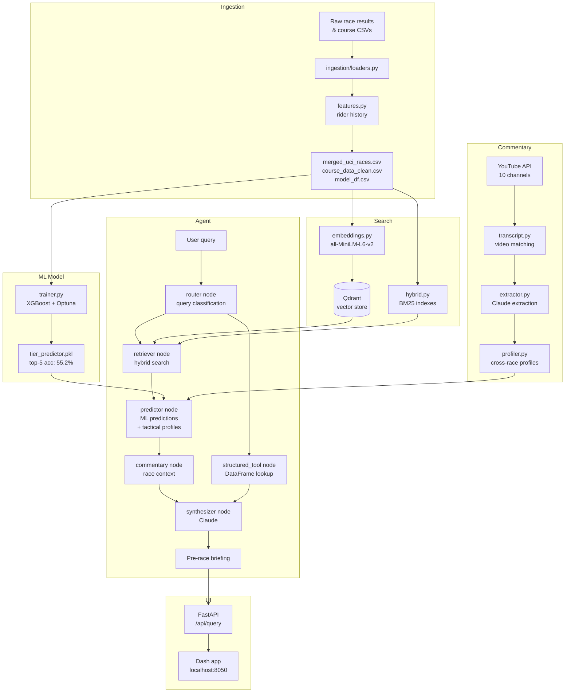

# PelotonIQ

**UCI WorldTour race intelligence powered by ML, RAG, and LLM synthesis.**

PelotonIQ goes beyond statistics. It combines an XGBoost finish-probability model with hybrid semantic search and — critically — **tactical profiles synthesized from 300+ race commentary transcripts**. The result is a pre-race briefing that tells you not just who the model favours, but *how* they typically attack, where they're vulnerable, and what their team does before they make their move. That's intelligence a general-purpose LLM with web search can't replicate without your specific dataset.


---

## Architecture



---

## Stack

| Layer | Technology |
|---|---|
| ML model | XGBoost, Optuna (50-trial HPO), scikit-learn |
| Embeddings | sentence-transformers `all-MiniLM-L6-v2` |
| Vector store | Qdrant (hybrid dense + BM25 sparse) |
| Agent framework | LangGraph (5-node pipeline) |
| LLM | Anthropic Claude (routing, extraction, synthesis) |
| Commentary | YouTube Data API, youtube-transcript-api |
| API | FastAPI + Pydantic |
| UI | Plotly Dash |
| Orchestration | Prefect |
| Config | Pydantic Settings |
| CI | GitHub Actions + ruff |
| Data | 140k+ rows, 7 seasons (2017–2023), 8,092 GPX files |

---

## What makes it different

Most cycling analytics projects stop at statistics. PelotonIQ adds a layer that can't be scraped from a leaderboard:

**Cross-race tactical profiles.** The commentary pipeline fetches transcripts from 10 YouTube channels, runs a Claude extraction pass to pull structured tactical observations, then synthesizes patterns across a rider's full appearance history into a profile:

```
POGAČAR Tadej  [high confidence · 18 races]
  Attack style: Attacks on penultimate climb in 14/18 mountain stages,
                rarely from the final 2km
  Vulnerability: Has shown weakness under repeated accelerations within 3km
  • UAE controls tempo through valley sections before Pogačar accelerates
  • Won solo from breakaway 11x, never from bunch sprint in dataset
  • Form: positive — strongest finishes in final Grand Tour stages
```

This profile is injected alongside the ML predictions into the synthesizer — turning a probability table into intelligence a directeur sportif would actually use.

---

## Project structure

```
peloton-iq/
├── src/peloton_iq/
│   ├── config.py              # Pydantic Settings, all path constants
│   ├── schemas/               # Typed data contracts (race, rider, agent, commentary)
│   ├── ingestion/             # loaders, filters, feature engineering, GPX parser
│   ├── search/                # embeddings, BM25, hybrid RRF search
│   ├── prediction/            # XGBoost trainer + predictor
│   ├── commentary/            # YouTube cache, transcript fetcher, Claude extractor, profiler
│   ├── agent/                 # LangGraph tools, nodes, graph assembly
│   ├── pipelines/             # Prefect flows (ingest, embed, train, commentary)
│   ├── api/                   # FastAPI app
│   └── app.py                 # Dash frontend
├── scripts/
│   ├── run_ingestion.py       # Build processed data from raw
│   ├── run_embeddings.py      # Load vectors into Qdrant
│   ├── run_training.py        # Train XGBoost model
│   ├── run_commentary.py      # Fetch transcripts + run extractions
│   ├── build_profiles.py      # Build rider tactical profiles
│   ├── build_gpx_cache.py     # Parse 8,092 GPX files → single parquet
│   ├── run_api.py             # Start FastAPI server
│   ├── run_dash.py            # Start Dash app
│   └── run_agent.py           # CLI agent interface
├── tests/
│   ├── conftest.py            # Synthetic DataFrame fixtures
│   ├── test_tools.py          # Agent tool function tests
│   └── test_commentary.py     # Label, matching, and normalization tests
├── Dockerfile
├── render.yaml
└── pyproject.toml
```

---

## Local setup

### Prerequisites
- Python 3.12
- [uv](https://docs.astral.sh/uv/)
- Docker (for Qdrant)

### 1. Install dependencies

```bash
uv pip install -e ".[dev]"
```

### 2. Environment variables

Create `.env` in the project root:

```
PELOTON_ANTHROPIC_API_KEY=your_key
PELOTON_YOUTUBE_API_KEY=your_key
```

### 3. Start Qdrant

```bash
docker run -p 6333:6333 qdrant/qdrant
```

### 4. Build the pipeline

```bash
# Ingestion → processed CSVs
python scripts/run_ingestion.py --prod

# Embeddings → Qdrant
python scripts/run_embeddings.py

# Train ML model
python scripts/run_training.py --prod

# GPX elevation cache
python scripts/build_gpx_cache.py

# Commentary (requires YouTube + Anthropic API keys)
python scripts/run_commentary.py
python scripts/run_commentary.py --extract --max-extractions 316
python scripts/build_profiles.py
```

### 5. Run the app

```bash
# Terminal 1 — FastAPI backend
python scripts/run_api.py

# Terminal 2 — Dash frontend
python scripts/run_dash.py
```

Open `http://localhost:8050`

### 6. CLI agent

```bash
python scripts/run_agent.py --check
python scripts/run_agent.py --query "Pre-race briefing for TDF 2023 Stage 17"
python scripts/run_agent.py
```

---

## Tests

```bash
python -m pytest tests/ -v
```

---

## Data sources

- **Race results & course profiles** — [Figshare cycling dataset](https://figshare.com) (2017–2023)
- **GPX elevation profiles** — 8,092 files from the same Figshare dataset
- **Race commentary** — YouTube Data API across 10 channels including official Tour de France, Giro d'Italia, and Vuelta a España channels